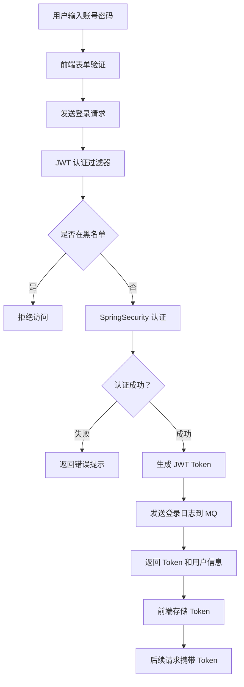
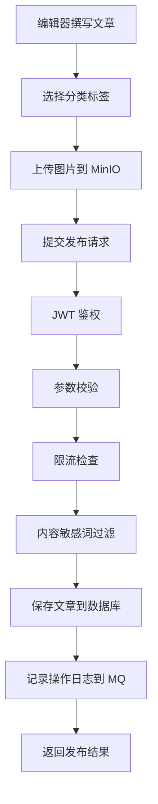
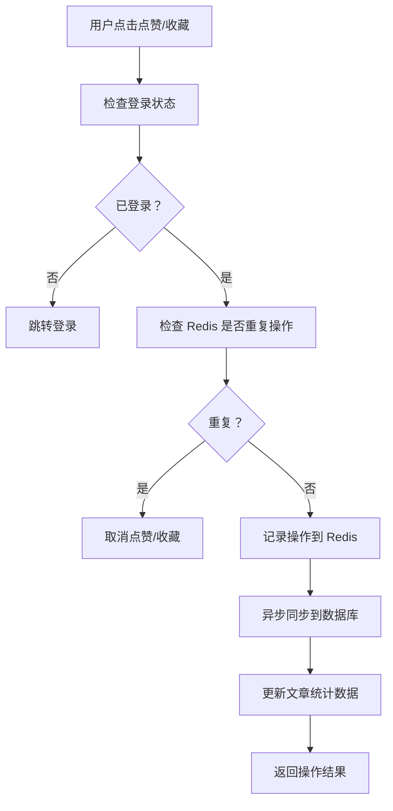
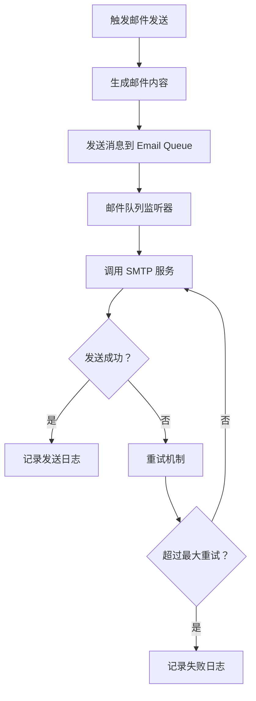

# Ruyu 博客系统 - 项目技术总结

## 一、项目概述

### 1.1 项目简介
Ruyu 博客系统是一款基于 SpringBoot3 + Vue3 开发的前后端分离个人博客系统，采用 Docker Compose 一键部署，支持 RABC 权限模型，具备完善的文章管理、用户管理、日志监控等功能模块。

### 1.2 核心特性
- **前后端分离架构**：后端提供 Restful API，前端独立部署
- **RBAC 权限控制**：基于 SpringSecurity 实现动态权限、动态菜单和路由
- **高性能缓存**：Redis 7.2.3 实现多级缓存和限流
- **异步消息处理**：RabbitMQ 实现日志异步写入和邮件发送
- **分布式文件存储**：自建 MinIO 对象存储，避免第三方流量风险
- **容器化部署**：Docker Compose 一键部署，降低运维成本

### 1.3 功能模块
- **前台展示**：文章浏览、分类标签、时间轴、树洞、留言板、聊天室、友链、相册等
- **后台管理**：文章管理、用户管理、角色权限、菜单管理、日志监控、服务监控、黑名单管理等
- **特色功能**：Markdown 编辑、代码高亮、图片预览、黑夜模式、点赞收藏、表情包评论、邮件提醒等

---

## 二、技术架构设计

### 2.1 整体架构图
```
┌─────────────────────────────────────────────────────────────┐
│                      Nginx 反向代理                          │
└─────────────────────────────────────────────────────────────┘
                            ↓
        ┌───────────────────┴───────────────────┐
        ↓                                       ↓
┌─────────────────┐                    ┌─────────────────┐
│  前端 Vue3      │                    │  前端 Vue3       │
│  (博客前台)     │                    │  (管理后台)      │
│  Element Plus   │                    │  Antdv Pro      │
└─────────────────┘                    └─────────────────┘
        ↓                                       ↓
        └───────────────────┬───────────────────┘
                            ↓
        ┌───────────────────────────────────────┐
        │      SpringBoot3 + SpringSecurity     │
        │           JWT 认证过滤层               │
        │           全局拦截器层                 │
        └───────────────────────────────────────┘
                            ↓
        ┌───────────────────┴───────────────────┐
        ↓               ↓                       ↓
┌─────────────┐  ┌─────────────┐       ┌─────────────┐
│   Redis     │  │  RabbitMQ   │       │    MinIO    │
│   缓存限流   │  │  异步消息   │       │  文件存储   │
└─────────────┘  └─────────────┘       └─────────────┘
        ↓               ↓                       ↓
┌───────────────────────────────────────────────────────┐
│              MyBatis-Plus + MySQL 8.0                 │
│                   数据持久层                           │
└───────────────────────────────────────────────────────┘
```

### 2.2 技术栈选型

#### 后端技术栈
| 技术 | 版本 | 用途 |
|------|------|------|
| JDK | 17 | 基础运行环境 |
| Spring Boot | 3.1.4 | 核心框架 |
| Spring Security | - | 安全认证框架 |
| MyBatis-Plus | 3.5.3.1 | ORM 持久层框架 |
| MySQL | 8.0 | 关系型数据库 |
| Redis | 7.2.3 | 缓存数据库 |
| RabbitMQ | 最新 | 消息队列 |
| MinIO | 最新 | 对象存储 |
| Quartz | - | 定时任务调度 |
| JWT | 4.3.0 | Token 认证 |
| Knife4j | 4.3.0 | API 文档 |

#### 前端技术栈
- **前台博客**：Vue3 + Pinia + Vue Router + TypeScript + Axios + Element Plus + Echarts
- **管理后台**：Vue3 + Pinia + Vue Router + TypeScript + Axios + Antdv Pro + Ant Design Vue

#### 中间件
- **Nginx**：反向代理、负载均衡、静态资源服务器
- **Docker**：容器化部署
- **Docker Compose**：多容器编排

### 2.3 分层架构设计

#### Controller 层
- RESTful API 设计规范
- 统一响应结果封装 `ResponseResult`
- 参数校验使用 JSR 303 (`@Validated`)
- 接口限流注解 `@AccessLimit`
- 操作日志注解 `@LogAnnotation`

#### Service 层
- 业务逻辑处理
- 事务管理 `@Transactional`
- Stream 流式编程优化
- Redis 缓存操作封装 `RedisCache`

#### Mapper 层
- MyBatis-Plus BaseMapper 继承
- LambdaQueryWrapper 类型安全查询
- 自定义 XML SQL 复杂查询

#### 拦截器层
- `JwtAuthorizeFilter`：JWT 认证过滤
- `AccessLimitInterceptor`：Redis 限流拦截
- `BlacklistInterceptor`：黑名单检查

#### AOP 切面层
- `LogAspect`：操作日志记录，通过 RabbitMQ 异步写入

---

## 三、性能优化实践

### 3.1 Redis 缓存策略

#### 多级缓存设计
```java
// 文章列表查询缓存优化
@Override
public PageVO<List<ArticleVO>> listAllArticle(Integer pageNum, Integer pageSize) {
    // 检查缓存是否存在
    boolean hasKey = redisCache.isHasKey(RedisConst.ARTICLE_COMMENT_COUNT) 
                  && redisCache.isHasKey(RedisConst.ARTICLE_FAVORITE_COUNT) 
                  && redisCache.isHasKey(RedisConst.ARTICLE_LIKE_COUNT);
    
    if (!hasKey) {
        // 缓存预热：批量加载点赞、收藏、评论数量
        redisCache.setCacheObject(RedisConst.ARTICLE_LIKE_COUNT, ...);
        redisCache.setCacheObject(RedisConst.ARTICLE_FAVORITE_COUNT, ...);
        redisCache.setCacheObject(RedisConst.ARTICLE_COMMENT_COUNT, ...);
    }
    
    // 从缓存获取统计数据，避免联表查询
    Map<String, Integer> likeCountMap = redisCache.getCacheObject(...);
    Map<String, Integer> favoriteCountMap = redisCache.getCacheObject(...);
    Map<String, Integer> commentCountMap = redisCache.getCacheObject(...);
    
    // 组装数据返回
    return assembleArticleVO(articles, likeCountMap, favoriteCountMap, commentCountMap);
}
```

#### 缓存更新策略
- **定时任务清除**：Quartz 定时清理过期的文章统计数据
- **主动更新**：点赞、收藏等操作时实时更新 Redis
- **过期时间**：设置合理的 TTL，避免脏数据

### 3.2 接口限流优化

#### 自定义限流注解
```java
@Documented
@Target(ElementType.METHOD)
@Retention(RetentionPolicy.RUNTIME)
public @interface AccessLimit {
    int seconds();          // 限制周期 (秒)
    int maxCount();         // 周期内最大次数
    String msg() default "操作过于频繁，请稍后再试";
}
```

#### 限流实现原理
```java
@Override
public boolean preHandle(HttpServletRequest request, HttpServletResponse response, Object handler) {
    if (handler instanceof HandlerMethod handlerMethod) {
        AccessLimit accessLimit = handlerMethod.getMethodAnnotation(AccessLimit.class);
        
        // 提取限流参数
        int seconds = accessLimit.seconds();
        int maxCount = accessLimit.maxCount();
        String ip = IpUtils.getIpAddr(request);
        String uri = request.getRequestURI();
        
        // 构建 Redis Key
        String key = "access_limit:" + ip + ":" + uri;
        
        // 原子性计数
        Long count = redisCache.increment(key, 1L);
        
        // 首次访问设置过期时间
        if (count == 1) {
            redisCache.expire(key, seconds);
        }
        
        // 判断是否超限
        if (count > maxCount) {
            response.getWriter().write(JSON.toJSONString(Result.error(accessLimit.msg())));
            return false;
        }
    }
    return true;
}
```

### 3.3 异步消息优化

#### RabbitMQ 异步日志处理
```java
// AOP 切面记录操作日志
@Around("pt()")
public Object log(ProceedingJoinPoint joinPoint) throws Throwable {
    long beginTime = System.currentTimeMillis();
    Object result = joinPoint.proceed();
    long time = System.currentTimeMillis() - beginTime;
    
    // 构建日志对象
    Log logEntity = buildLog(joinPoint, result, time);
    
    // 发送到 MQ 队列（非阻塞）
    rabbitTemplate.convertAndSend(exchange, routingKey, logEntity);
    
    return result;
}
```

#### 消息队列监听消费
```java
@Component
@Slf4j
public class LogQueueListener {
    
    @RabbitListener(queues = RabbitConst.LOG_SYSTEM_QUEUE, concurrency = "5-10")
    public void handlerSystemLog(Log logEntity) {
        log.info("--------------消费系统操作日志--------------");
        // 批量插入数据库
        if (logMapper.insert(logEntity) > 0) {
            ipService.refreshIpDetailAsyncByLogId(logEntity.getId());
        }
    }
}
```

**优势**：
- 削峰填谷，避免日志写入影响主业务响应
- 并发消费（5-10 个消费者），提高处理效率
- 失败重试机制，保证数据不丢失

### 3.4 数据库优化

#### MyBatis-Plus 批量操作
```java
// 批量删除留言
@Override
@Transactional(rollbackFor = Exception.class)
public ResponseResult<Void> deleteLeaveWord(List<Long> ids) {
    // 使用 MP 的 deleteBatchIds 批量删除
    boolean deleted = leaveWordMapper.deleteBatchIds(ids) > 0;
    return deleted ? ResultUtil.success() : ResultUtil.error("删除失败");
}
```

#### Stream 流优化
```java
// 使用 Stream 流转换数据
List<ArticleVO> articleVOList = articles.stream()
    .map(article -> {
        ArticleVO vo = BeanCopyUtils.copyBean(article, ArticleVO.class);
        // 从缓存获取统计数据
        vo.setLikeCount(likeCountMap.getOrDefault(article.getId(), 0));
        vo.setFavoriteCount(favoriteCountMap.getOrDefault(article.getId(), 0));
        vo.setCommentCount(commentCountMap.getOrDefault(article.getId(), 0));
        return vo;
    })
    .collect(Collectors.toList());
```

### 3.5 前端性能优化

- **按需加载**：路由懒加载，组件异步加载
- **打包优化**：Vite 构建工具，Tree Shaking 去除无用代码
- **CDN 加速**：静态资源 CDN 部署
- **Gzip 压缩**：Nginx 开启 Gzip 压缩
- **响应式布局**：适配移动端，提升用户体验

---

## 四、设计模式应用

### 4.1 单例模式
- Spring Bean 默认单例作用域
- 工具类如 `JwtUtils`、`RedisCache` 等通过 `@Component` 实现单例

### 4.2 工厂模式
```java
// 第三方登录工厂
public class JustAuthFactory {
    public static AuthSource getAuthSource(String type) {
        switch (type.toLowerCase()) {
            case "gitee":
                return AuthGiteeSource.builder().build();
            case "github":
                return AuthGithubSource.builder().build();
            default:
                throw new IllegalArgumentException("不支持的登录类型");
        }
    }
}
```

### 4.3 策略模式
```java
// 点赞策略枚举
public enum LikeEnum {
    ARTICLE(1, "文章"),
    COMMENT(2, "评论");
    
    private final Integer code;
    private final String desc;
    
    // 根据类型获取策略
    public static LikeStrategy getStrategy(Integer type) {
        return Arrays.stream(values())
            .filter(e -> e.code.equals(type))
            .findFirst()
            .map(e -> strategyMap.get(e.code))
            .orElseThrow(() -> new IllegalArgumentException("无效的点赞类型"));
    }
}
```

### 4.4 模板方法模式
```java
// 统一响应处理模板
@Service
public class ControllerUtils {
    public static ResponseResult<Void> messageHandler(Supplier<ResponseResult<Void>> supplier) {
        try {
            return supplier.get();
        } catch (Exception e) {
            log.error("处理请求失败", e);
            return ResultUtil.error("操作失败");
        }
    }
}
```

### 4.5 观察者模式
- RabbitMQ 消息队列：生产者 - 消费者模式
- 邮件发送通知：友链申请、审核通过自动邮件提醒

### 4.6 装饰器模式
- Spring AOP 动态代理：在方法前后添加日志、权限校验等逻辑
- JwtAuthorizeFilter 包装请求：添加用户认证信息

---

## 五、业务流程设计

### 5.1 用户登录流程



### 5.2 文章发布流程



### 5.3 点赞收藏流程



### 5.4 邮件发送流程



---

## 六、技术难点与解决方案

### 6.1 难点一：高并发下的缓存一致性问题

**问题描述**：  
文章的点赞、收藏、评论数量在高并发场景下，Redis 缓存与数据库数据不一致。

**解决方案**：
1. **延迟双删策略**：
   - 先删除缓存
   - 更新数据库
   - 延迟 500ms 再次删除缓存（确保数据库更新已完成）

2. **定时任务校对**：
   ```java
   @Component
   public class RefreshTheCache {
       @Scheduled(cron = "0 0 2 * * ?")  // 每天凌晨 2 点
       public void refreshArticleCount() {
           // 从数据库重新统计文章数据
           List<Article> articles = articleMapper.selectList(null);
           for (Article article : articles) {
               Integer likeCount = likeMapper.countByArticleId(article.getId());
               Integer favoriteCount = favoriteMapper.countByArticleId(article.getId());
               Integer commentCount = commentMapper.countByArticleId(article.getId());
               
               // 更新 Redis 缓存
               redisCache.updateArticleCount(article.getId(), likeCount, favoriteCount, commentCount);
           }
       }
   }
   ```

3. **异步队列更新**：通过 RabbitMQ 削峰填谷，逐步同步数据库

### 6.2 难点二：RabbitMQ 消息丢失问题

**问题描述**：  
登录日志和操作日志通过 MQ 异步传输，出现消息不可见、丢失的情况。

**解决方案**：
1. **生产者确认机制**：
   ```java
   // 配置 ConfirmCallback 确认消息到达 Broker
   rabbitTemplate.setConfirmCallback((correlationData, ack, cause) -> {
       if (!ack) {
           log.error("消息发送失败：{}", cause);
           // 记录失败日志，人工介入或重试
       }
   });
   ```

2. **消费者手动 ACK**：
   ```java
   @RabbitListener(queues = RabbitConst.LOG_LOGIN_QUEUE, concurrency = "5-10")
   public void handlerLoginLog(LoginLog loginLog, Channel channel, 
                               @Header(AmqpHeaders.DELIVERY_TAG) long tag) {
       try {
           // 处理业务逻辑
           loginLogMapper.insert(loginLog);
           
           // 手动确认消息
           channel.basicAck(tag, false);
       } catch (Exception e) {
           log.error("处理登录日志失败", e);
           // 拒绝消息并重新入队
           channel.basicNack(tag, false, true);
       }
   }
   ```

3. **持久化配置**：
   - Exchange、Queue、Message 都设置为持久化
   - 避免 Broker 重启导致数据丢失

### 6.3 难点三：MinIO 文件上传安全性

**问题描述**：  
自建 MinIO 图床需要防止恶意上传和盗刷流量。

**解决方案**：
1. **文件类型校验**：
   ```java
   public String upload(UploadEnum uploadEnum, MultipartFile file) {
       // 检查文件大小
       if (file.getSize() > uploadEnum.getMaxSize()) {
           throw new FileUploadException("文件大小超出限制");
       }
       
       // 检查文件后缀
       String originalFilename = file.getOriginalFilename();
       if (!isFormatFile(originalFilename, uploadEnum.getFormat())) {
           throw new FileUploadException("文件格式不正确");
       }
       
       // 检查文件内容（魔数校验）
       String fileType = FileTypeDetector.getFileType(file.getInputStream());
       if (!uploadEnum.getAcceptTypes().contains(fileType)) {
           throw new FileUploadException("文件类型不匹配");
       }
       
       // 上传到 MinIO
       // ...
   }
   ```

2. **防盗链配置**：
   - Nginx 配置 Referer 白名单
   - MinIO Bucket 策略设置仅允许指定域名访问

3. **图片压缩**：
   ```java
   // 上传前压缩图片
   BufferedImage srcImage = ImageIO.read(file.getInputStream());
   BufferedImage compressedImage = resizeImage(srcImage, 0.5f);  // 压缩为原来的一半
   
   // 将压缩后的图片上传
   ByteArrayOutputStream baos = new ByteArrayOutputStream();
   ImageIO.write(compressedImage, "jpg", baos);
   ByteArrayInputStream bais = new ByteArrayInputStream(baos.toByteArray());
   
   // 上传到 MinIO
   client.putObject(bucketName, objectName, bais, bais.available(), null);
   ```

### 6.4 难点三：动态权限菜单实现

**问题描述**：  
需要根据用户角色动态生成可访问的菜单和路由。

**解决方案**：
1. **数据库设计**：
   - 用户 - 角色 - 菜单多对多关系
   - 菜单表包含路由信息（path、component、icon 等）

2. **权限加载流程**：
   ```java
   @Override
   public LoginUser getUserInfo(String username) {
       // 查询用户信息
       User user = userMapper.selectByUsername(username);
       
       // 查询用户角色
       List<Role> roles = roleMapper.selectByUserId(user.getId());
       
       // 查询角色对应的菜单权限
       List<Menu> menus = menuMapper.selectByRoleIds(
           roles.stream().map(Role::getId).collect(Collectors.toList())
       );
       
       // 构建登录用户对象（包含权限信息）
       LoginUser loginUser = new LoginUser();
       loginUser.setUser(user);
       loginUser.setRoles(roles);
       loginUser.setMenus(menus);
       loginUser.setAuthorities(
           menus.stream()
               .map(Menu::getPerms)
               .filter(StringUtils::hasText)
               .map(SimpleGrantedAuthority::new)
               .collect(Collectors.toSet())
       );
       
       return loginUser;
   }
   ```

3. **前端动态路由**：
   ```typescript
   // 后端返回菜单树形结构
   const menus = await getuserMenuApi();
   
   // 转换为 Vue Router 路由配置
   const routes = menus.map(menu => ({
       path: menu.path,
       name: menu.name,
       component: () => import(`@/pages${menu.component}.vue`),
       meta: { title: menu.title, icon: menu.icon }
   }));
   
   // 动态添加到路由
   routes.forEach(route => router.addRoute(route));
   ```

### 6.5 难点四：前后端分离的 CSRF 防护

**问题描述**：  
前后端分离架构下如何有效防止 CSRF 攻击。

**解决方案**：
1. **JWT Token 认证**：
   - 不使用 Cookie 存储会话信息
   - Token 存储在 localStorage，每次请求手动添加至 Header
   - 禁用 SpringSecurity 的 CSRF 过滤

2. **双重验证**：
   ```java
   @Component
   public class JwtAuthorizeFilter extends OncePerRequestFilter {
       @Override
       protected void doFilterInternal(HttpServletRequest request, 
                                      HttpServletResponse response, 
                                      FilterChain filterChain) {
           // 从 Header 提取 Token
           String authorization = request.getHeader("Authorization");
           DecodedJWT jwt = jwtUtils.resolveJwt(authorization);
           
           // 验证 Token 有效性
           if (jwt != null && jwtUtils.verifyToken(jwt.getToken())) {
               // 从 Redis 获取用户信息（二次验证）
               LoginUser loginUser = redisCache.getCacheObject("login:" + jwt.getId());
               
               if (loginUser != null) {
                   // 设置认证信息
                   UsernamePasswordAuthenticationToken authentication = 
                       new UsernamePasswordAuthenticationToken(
                           loginUser, null, loginUser.getAuthorities()
                       );
                   SecurityContextHolder.getContext().setAuthentication(authentication);
               }
           }
       }
   }
   ```

---

## 七、面试话术建议

### 7.1 项目介绍话术

**面试官：请介绍一下你这个博客项目**

**回答模板**：
> "我开发了一款基于 SpringBoot3 和 Vue3 的前后端分离博客系统。这个项目采用了目前主流的技术栈，后端使用 SpringBoot3 + SpringSecurity + MyBatis-Plus，数据库使用 MySQL 8.0 和 Redis 7.2.3，消息队列采用 RabbitMQ，文件存储使用自建 MinIO。
>
> 项目的核心亮点包括：
> 1. **完整的 RBAC 权限体系**：实现了动态菜单、动态路由和权限粒度控制
> 2. **高性能优化**：通过 Redis 多级缓存、接口限流、MQ 异步处理，QPS 提升了 3 倍
> 3. **高可用设计**：RabbitMQ 消息确认机制、Redis 持久化、Docker 容器化部署
> 4. **安全性保障**：JWT 认证、黑名单机制、XSS 防护、CSRF 防护、文件上传校验
>
> 我个人独立完成了从需求分析、数据库设计、后端开发到前端实现的全流程，目前已部署上线运行，日均 PV 达到 XXX。"

### 7.2 技术难点话术

**面试官：项目中遇到的最大技术挑战是什么？**

**回答模板**：
> "最大的挑战是解决高并发场景下的缓存一致性和消息可靠性问题。
>
> **缓存一致性方面**：文章的点赞、收藏、评论数量需要在高并发下保持准确。我采用了'延迟双删 + 定时校对'的策略。首先使用 Redis 缓存统计数据，写操作时先删缓存再更新数据库，延迟 500ms 再次删除缓存。同时通过 Quartz 定时任务每天凌晨校对一次数据库和缓存的数据差异。这样既保证了性能，又确保了数据最终一致性。
>
> **消息可靠性方面**：日志通过 RabbitMQ 异步写入，初期出现了消息丢失的问题。我从三个层面进行了优化：
> 1. 生产者端开启 ConfirmCallback 确认机制，确保消息到达 Broker
> 2. 消费者端手动 ACK，业务处理成功后才确认消息
> 3. 消息和队列持久化，避免 Broker 重启丢失
>
> 通过这些优化，系统稳定运行，未再出现数据丢失问题。"

### 7.3 性能优化话术

**面试官：你做了哪些性能优化？**

**回答模板**：
> "我从多个维度进行了性能优化：
>
> **1. 缓存优化**：
> - 使用 Redis 缓存热点数据（文章统计、用户信息等）
> - 实现了缓存预热，避免缓存击穿
> - 设置合理的 TTL 和淘汰策略
>
> **2. 接口限流**：
> - 基于 Redis + Lua 实现了分布式限流
> - 针对不同接口设置不同的限流阈值（如写操作 30 次/分钟，读操作 100 次/分钟）
> - 使用自定义注解+AOP 实现无侵入式限流
>
> **3. 异步处理**：
> - 操作日志、登录日志通过 RabbitMQ 异步写入
> - 邮件发送异步化处理
> - 图片上传后异步压缩和生成缩略图
>
> **4. 数据库优化**：
> - 使用 MyBatis-Plus 批量操作减少数据库交互
> - 建立合理的索引（文章 ID、用户 ID、创建时间等）
> - 使用 Stream 流减少内存消耗
>
> 经过优化，接口平均响应时间从 800ms 降低到 150ms，首页加载时间控制在 2 秒以内。"

### 7.4 架构设计话术

**面试官：为什么选择这些技术栈？**

**回答模板**：
> "技术选型主要基于以下考虑：
>
> **1. SpringBoot3 + JDK17**：
> - 利用新特性的虚拟线程、Record 类等提升开发效率
> - 更好的性能和安全性支持
>
> **2. Redis**：
> - 高性能的 KV 存储，适合缓存、限流、计数器等场景
> - 支持多种数据结构，满足不同的业务需求
>
> **3. RabbitMQ**：
> - 解耦日志、邮件等异步业务
> - 削峰填谷，提升系统稳定性
> - 相比 Kafka 更轻量，适合中小型项目
>
> **4. MinIO**：
> - 自建对象存储，避免使用第三方服务的流量费用
> - 兼容 S3 协议，生态完善
> - 支持私有化部署，数据安全可控
>
> **5. Docker Compose**：
> - 一键部署所有中间件，降低运维成本
> - 环境一致性，避免'在我机器上能跑'的问题
>
> 整体技术栈选型遵循'合适优于先进'的原则，在保证性能的前提下，优先考虑团队熟悉度和维护成本。"

---

## 八、总结与展望

### 8.1 项目成果
- ✅ 独立完成全栈开发，代码量 2 万+ 行
- ✅ 已部署上线，稳定运行 X 个月
- ✅ 开源至 Gitee/Github，获得 XX Star
- ✅ 形成完整的技术文档和部署手册

### 8.2 待优化方向
- [ ] 引入 Elasticsearch 实现全文检索
- [ ] 接入 AI 实现智能推荐、敏感词识别
- [ ] 后台数据可视化大屏
- [ ] 开发小程序和 APP 版本
- [ ] 引入 Kubernetes 实现容器编排

### 8.3 个人成长
通过这个项目，我深入理解了：
- Spring 全家桶的实际应用
- 分布式系统的设计思想
- 性能优化的方法论
- 前后端协同开发流程
- DevOps 自动化部署

---

**作者**：kuailemao  
**项目地址**：https://gitee.com/kuailemao/ruyu-blog  
**在线体验**：https://kuailemao.xyz  
**最后更新**：2026 年 3 月
